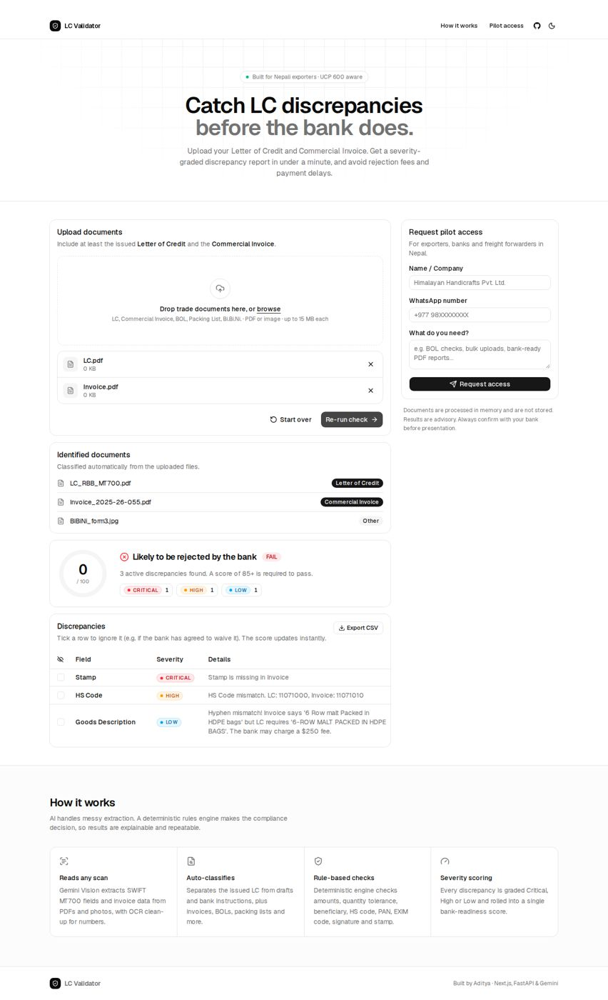

# LC Validator

AI-powered checker that compares a **Letter of Credit (SWIFT MT700)** against a **Commercial Invoice** for Nepali exporters and flags discrepancies by severity (Critical / High / Low) before the bank does.



## Tech stack
- **Frontend:** Next.js 16, TypeScript, Tailwind CSS v4, shadcn/ui
- **Backend:** Python, FastAPI, Pydantic, Gemini Vision API
- **Logic:** AI extracts fields; a deterministic rules engine (`backend/compare.py`) decides compliance: amount/quantity tolerance, beneficiary fuzzy match, HS code, PAN, EXIM code, signature and stamp.

## Project structure
```
backend/    FastAPI API (main.py) + extraction & comparison logic
frontend/   Next.js app
```

## Run locally

**Backend**
```bash
cd backend
python -m venv .venv && source .venv/bin/activate   # Windows: .venv\Scripts\activate
pip install -r requirements.txt
cp .env.example .env        # add your GEMINI_API_KEY
uvicorn main:app --reload --port 8000
```

**Frontend**
```bash
cd frontend
npm install
cp .env.example .env.local  # NEXT_PUBLIC_API_URL=http://localhost:8000
npm run dev
```
Open http://localhost:3000.

## API
| Method | Route | Description |
|---|---|---|
| POST | `/api/validate` | Upload files (multipart `files`), returns identified docs + discrepancy report |
| POST | `/api/leads` | Pilot-access form |
| GET | `/api/health` | Health check |

## Deploy
- Frontend → Vercel (root directory: `frontend`, env `NEXT_PUBLIC_API_URL`)
- Backend → Render / Railway (root directory: `backend`, env `GEMINI_API_KEY`, `ALLOWED_ORIGINS`)
